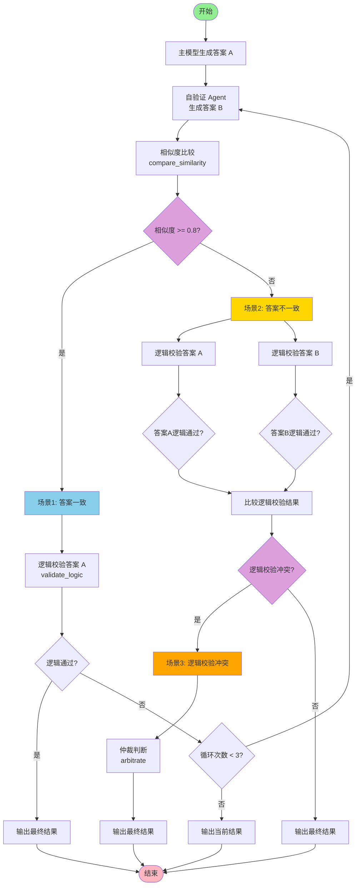

# Eino ADK 质检-验收流程示例

本示例演示如何使用 Eino ADK（Agent Development Kit）实现一个完整的质检-验收流程，用于评估和验证 AI 生成的答案质量。

## 流程说明

### 流程图




### 1. 质检阶段（Quality Check）

**Step 1: 系统调用自验证 Agent**
- 使用另一个大模型（相似或更大参数量）重新生成答案 B
- 对相同问题生成新的答案，用于对比验证

**Step 2: 答案比较**
- 使用相似度比较工具比较答案 A 和答案 B 的相似度
- 返回相似度分数（0-1）和是否一致的判断（相似度 >= 0.8 认为一致）

### 2. 验收阶段（Acceptance）

根据相似度比较结果，进入不同的验收场景：

**场景 1：答案一致（Answers Consistent）**
- 如果答案 A 和答案 B 相似度基本一致
- 调用小模型判断答案 A 的解题逻辑是否流畅
- 如果逻辑通过，输出最终结果

**场景 2：答案不一致（Answers Inconsistent）**
- 如果答案 A 和答案 B 差异较大
- 分别对答案 A 和答案 B 进行逻辑校验
- 比较两个答案的逻辑校验结果

**场景 3：逻辑校验冲突（Logic Validation Conflict）**
- 如果答案 A 通过逻辑校验但答案 B 不通过（或反之）
- 使用第三个模型进行仲裁判断
- 直到两个模型的结果匹配，才最终输出结果

### 流程限制

- 整个"质检-验收"流程最多循环 3 次

## 架构设计

### Agent 结构

1. **协调 Agent（Coordinator Agent）**
   - 主协调 Agent，负责协调整个质检-验收流程
   - 调用子 Agent 完成各个阶段的任务

2. **自验证 Agent（Self-Verify Agent）**
   - 使用另一个大模型重新生成答案 B
   - 作为协调 Agent 的子 Agent

3. **质检 Agent（Quality Check Agent）**
   - 负责答案相似度比较和逻辑校验
   - 包含三个工具：相似度比较、逻辑校验、仲裁
   - 作为协调 Agent 的子 Agent

### 工具说明

1. **相似度比较工具（compare_similarity）**
   - 输入：答案 A 和答案 B
   - 输出：相似度分数和是否一致的判断

2. **逻辑校验工具（validate_logic）**
   - 输入：答案内容和原始问题
   - 输出：逻辑是否流畅、合理的判断

3. **仲裁工具（arbitrate）**
   - 输入：答案 A、答案 B、问题和它们的逻辑校验结果
   - 输出：选择哪个答案更合理

## 环境要求

- Go 1.21 或更高版本
- 设置环境变量 `DASHSCOPE_API_KEY`（阿里云 DashScope API Key）

## 使用方法

1. 设置环境变量：
```bash
export DASHSCOPE_API_KEY=你的API密钥
```

2. 运行程序：
```bash
cd adk
go run main.go
```

3. 修改问题：
在 `main.go` 的 `main()` 函数中，可以修改 `question` 变量来测试不同的问题。

## 代码结构

- `main.go`：主程序文件
  - `createChatModel()`：创建聊天模型（支持不同模型配置）
  - `SimilarityTool`：相似度比较工具
  - `LogicValidationTool`：逻辑校验工具
  - `ArbitrateTool`：仲裁工具
  - `qualityCheckAndAcceptance()`：质检-验收流程主函数
  - `main()`：程序入口

## 模型配置

代码中定义了多个模型配置（可根据实际情况调整）：

- `chatModel`：主模型，用于生成答案 A（默认：qwen-plus）
- `verifyModel`：自验证模型，用于生成答案 B（默认：qwen-plus，可使用更大模型）
- `logicModel`：逻辑校验模型，小模型（默认：qwen-turbo）
- `arbitrateModel`：仲裁模型，第三个模型（默认：qwen-plus）

## 工作流程

### 文字描述

```
1. 主模型生成答案 A
   ↓
2. 协调 Agent 调用自验证 Agent 生成答案 B
   ↓
3. 协调 Agent 调用质检 Agent
   ↓
4. 质检 Agent 使用相似度比较工具比较答案 A 和 B
   ↓
5. 根据相似度结果：
   - 一致 → 逻辑校验答案 A → 通过则输出
   - 不一致 → 分别校验答案 A 和 B → 冲突则仲裁 → 输出
```

### 详细流程图

```
┌────────────────────────────────────────────────────────────────────────────┐
│                          质检-验收流程详细图                                 │
└────────────────────────────────────────────────────────────────────────────┘

                    ┌─────────────────┐
                    │  开始            │
                    └────────┬────────┘
                             │
                             ▼
                    ┌─────────────────┐
                    │  主模型生成答案A │
                    └────────┬────────┘
                             │
                             ▼
                    ┌─────────────────┐
                    │  自验证Agent    │
                    │  生成答案B      │
                    └────────┬────────┘
                             │
                             ▼
                    ┌─────────────────┐
                    │  相似度比较      │
                    │  (>= 0.8?)      │
                    └───┬─────────┬───┘
                        │ 是       │ 否
                        ▼          ▼
        ┌──────────────────┐  ┌──────────────────────┐
        │ 场景1: 答案一致   │  │ 场景2: 答案不一致     │
        └────────┬─────────┘  └───┬──────────────┬───┘
                 │                 │              │
                 ▼                 ▼              ▼
        ┌─────────────────┐  ┌──────────┐  ┌──────────┐
        │ 逻辑校验答案A    │  │ 校验答案A │  │ 校验答案B │
        └────────┬────────┘  └─────┬──────┘  └─────┬──────┘
                 │                 │              │
                 ▼                 └──────┬───────┘
        ┌─────────────────┐               │
        │ 逻辑通过?        │               ▼
        └───┬─────────┬───┘      ┌─────────────────┐
            │ 是       │ 否       │ 比较校验结果     │
            ▼          ▼         └───┬───────────┬───┘
    ┌──────────┐ ┌──────────┐       │ 冲突       │ 一致
    │ 输出结果  │ │ 循环重试?│       ▼            ▼
    └──────────┘ └───┬──────┘ ┌──────────────┐ ┌──────────┐
                     │ 是     │ 场景3: 冲突   │ │ 输出结果  │
                     │        │ 仲裁判断      │ └──────────┘
                     └────────┼──────────────┘
                              │
                              ▼
                     ┌─────────────────┐
                     │ 输出最终结果     │
                     └────────┬────────┘
                              │
                              ▼
                     ┌─────────────────┐
                     │ 结束             │
                     └─────────────────┘
```

## 扩展功能

可以进一步扩展该示例：

1. **更精确的相似度计算**：使用向量相似度或语义相似度算法
2. **多轮验证**：支持多轮质检-验收循环
3. **结果存储**：将质检结果和最终答案保存到数据库
4. **性能优化**：并行执行某些步骤以提高效率
5. **自定义评估标准**：根据具体业务需求调整评估标准

## 注意事项

- 确保网络连接正常，能够访问 DashScope API
- API Key 需要有足够的配额
- 流程的执行时间取决于模型响应速度和网络状况
- 可以根据实际需求调整模型配置和评估标准
