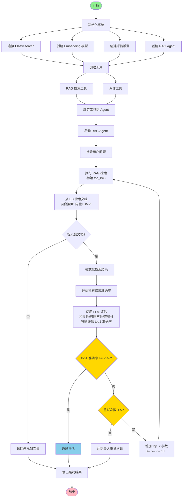

# RAG 检索与评估流程图

## 系统架构流程图



## 详细流程说明

### 1. 初始化阶段

```
┌─────────────────────────────────────────┐
│  系统初始化                              │
├─────────────────────────────────────────┤
│  • 连接 Elasticsearch                    │
│  • 创建 Embedding 模型                   │
│  • 创建评估 LLM 模型                    │
│  • 创建 RAG Agent                        │
│  • 创建并绑定工具                        │
└─────────────────────────────────────────┘
```

### 2. 检索与评估循环

```
┌─────────────────────────────────────────┐
│  检索阶段                                │
├─────────────────────────────────────────┤
│  输入: 用户问题                          │
│  操作: rag_retrieve(query, top_k)        │
│  输出: 检索到的文档列表                  │
└─────────────────────────────────────────┘
           ↓
┌─────────────────────────────────────────┐
│  评估阶段                                │
├─────────────────────────────────────────┤
│  输入: 问题 + 检索文档                   │
│  操作: rag_evaluate(query, documents)   │
│  评估维度:                               │
│    • 相关性 (relevance)                  │
│    • 可回答性 (answerability)            │
│    • 完整性 (completeness)               │
│  输出: 准确率分数 (0-1)                  │
└─────────────────────────────────────────┘
           ↓
┌─────────────────────────────────────────┐
│  判断阶段                                │
├─────────────────────────────────────────┤
│  准确率 >= 95%?                         │
│    ├─ 是 → 输出结果                      │
│    └─ 否 → 继续检索                      │
│         ├─ 增加 top_k                   │
│         ├─ 重试次数 < 5?                │
│         │   ├─ 是 → 继续循环             │
│         │   └─ 否 → 输出当前结果         │
└─────────────────────────────────────────┘
```

### 3. 工具说明

#### RAG 检索工具 (rag_retrieve)
- **功能**: 从 Elasticsearch 知识库检索相关文档
- **参数**:
  - `query`: 用户问题
  - `top_k`: 返回文档数量（默认 3，可动态调整）
- **返回**: JSON 格式的文档列表，包含内容、分数、元数据

#### 评估工具 (rag_evaluate)
- **功能**: 评估检索结果与问题的相关性，**特别关注 top1（最相关第一个文档）的准确率**
- **参数**:
  - `query`: 原始问题
  - `documents`: 检索到的文档内容列表
  - `retry_count`: 当前重试次数（可选）
- **返回**: JSON 格式的评估结果
  ```json
  {
    "accuracy": 0.85,
    "top1_accuracy": 0.82,
    "passed": false,
    "reason": "评估原因",
    "top1_reason": "top1文档的评估原因",
    "details": {
      "relevance": 0.90,
      "answerability": 0.80,
      "completeness": 0.85,
      "top1_relevance": 0.88,
      "top1_answerability": 0.75,
      "top1_completeness": 0.82
    }
  }
  ```
- **重要**: 只有 `top1_accuracy >= 0.95` 时，`passed` 才为 `true`

## 配置参数

| 参数 | 默认值 | 说明 |
|------|--------|------|
| `minAccuracy` | 0.95 | **top1 最低准确率要求（95%）** |
| `maxRetries` | 5 | 最大重试次数 |
| `initialTopK` | 3 | 初始检索文档数量 |
| `MaxIterations` | 20 | Agent 最大迭代次数 |

## 执行示例

```
问题: "风寒感冒的症状有哪些？"

[第1次检索]
  top_k = 3
  检索到 3 个文档
  整体准确率: 0.82 (82%)
  top1 准确率: 0.78 (78%)
  未达到要求，继续检索...

[第2次检索]
  top_k = 5
  检索到 5 个文档
  整体准确率: 0.88 (88%)
  top1 准确率: 0.85 (85%)
  未达到要求，继续检索...

[第3次检索]
  top_k = 7
  检索到 7 个文档
  整体准确率: 0.90 (90%)
  top1 准确率: 0.96 (96%)
  ✓ top1 准确率已达到要求！

[输出最终结果]
  包含检索到的文档内容（特别是 top1）和 top1 准确率
```

## 技术栈

- **框架**: Eino ADK (Agent Development Kit)
- **向量数据库**: Elasticsearch 8.16.0
- **Embedding 模型**: text-embedding-v3
- **LLM 模型**: qwen-plus
- **搜索模式**: 混合搜索（向量相似度 + BM25）

