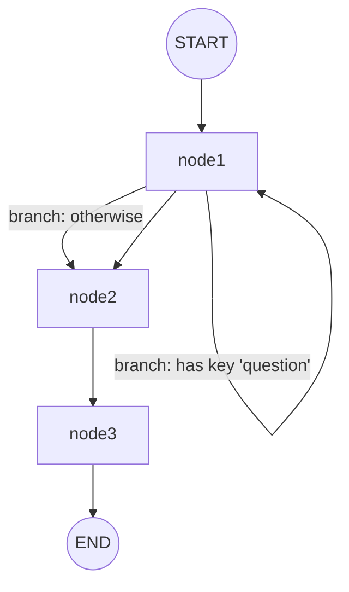

# Graph 模块流程图

本流程图对应 `graph/main.go` 第 24-73 行的节点与边的执行逻辑，展示了基于 CloudWeGo Eino 的图式编排：

## 节点说明
- `node1`：打印 "node1"，返回 `nil`（用于分支判断的输入映射位置）。
- `node2`：打印 "node2"，返回一条用户消息内容："矩形的长和宽分别是15厘米和7.5厘米"。
- `node3`：打印 "node3"，作为透传节点返回输入消息。
- `branch`：在 `node1` 之后进行分支选择：
  - 若输入 `map[string]any` 中存在键 `question`，返回到 `node1`；
  - 否则转到 `node2`。

## 边与流程


## 运行示例
在 `graph/` 目录下：
- `go run .`

示例输入：
```
map[string]any{
  "question": "一个矩形的长是宽的2倍，周长是30厘米，求长和宽分别是多少？",
}
```

示例输出（节选）：
- 控制台打印节点经过顺序：`node1 -> branch -> node1 -> node2 -> node3`
- 最终 `output.Content` 为 `node2` 返回的用户消息内容。

## 备注
- 若不含 `question` 键，分支会直接进入 `node2`，随后依次到 `node3` 并结束。
- 在该示例中，`node1` 的重复访问由分支条件触发；随后通过显式边 `node1 -> node2` 进入下游节点。